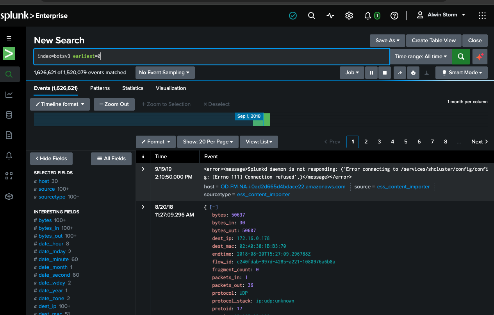
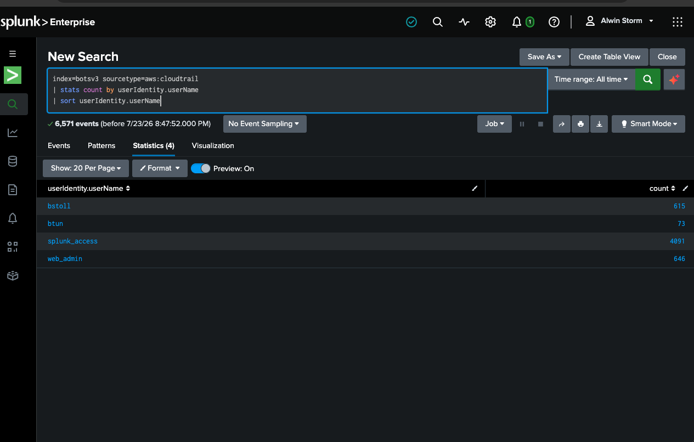
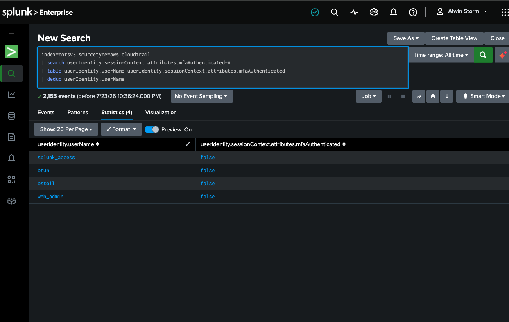
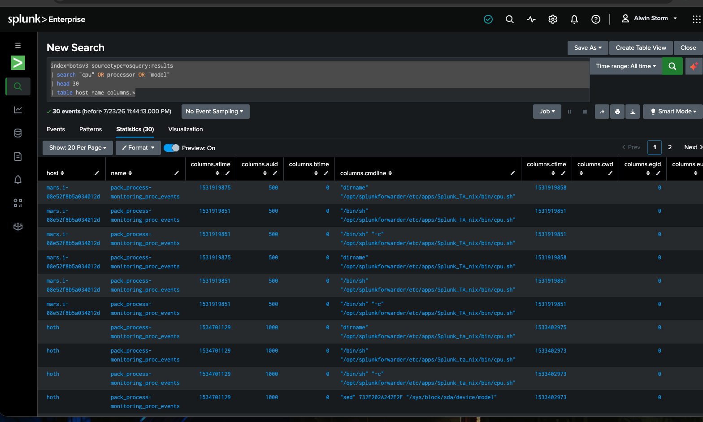
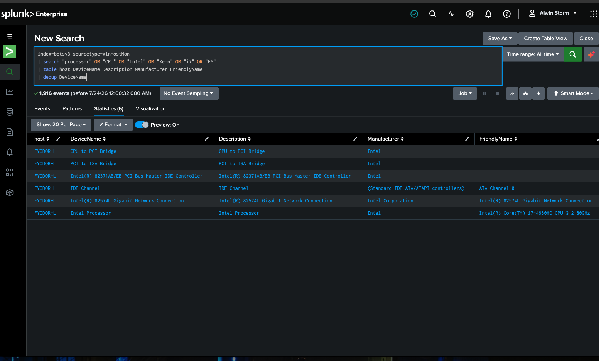
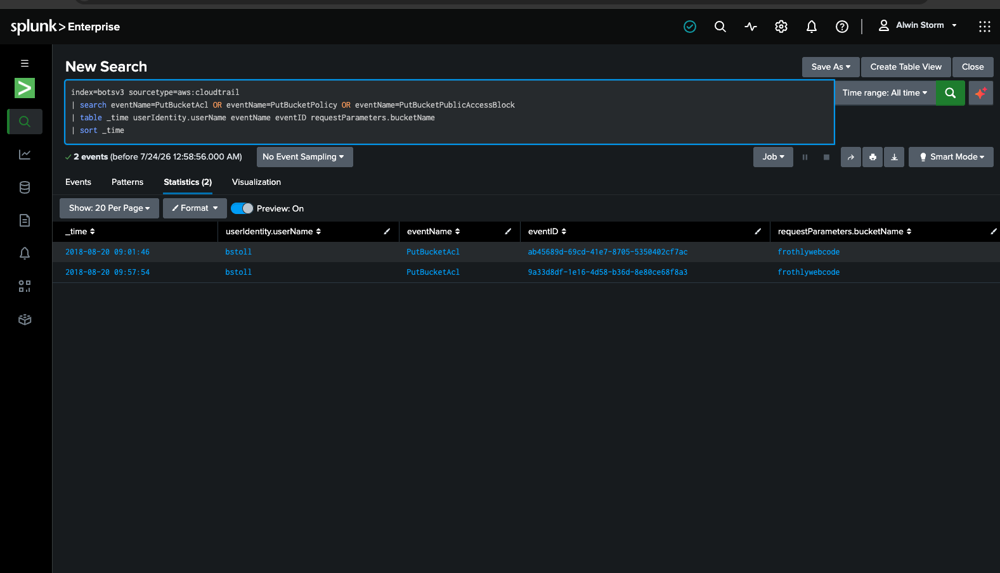
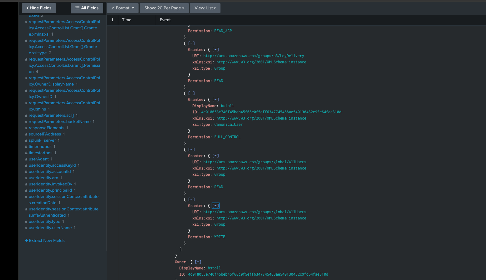
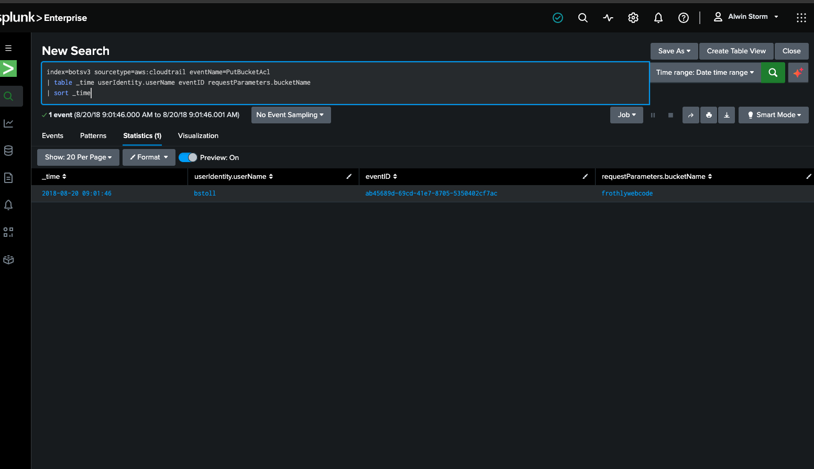
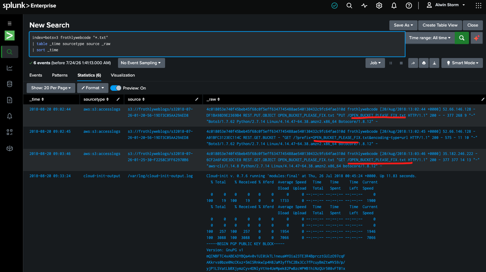
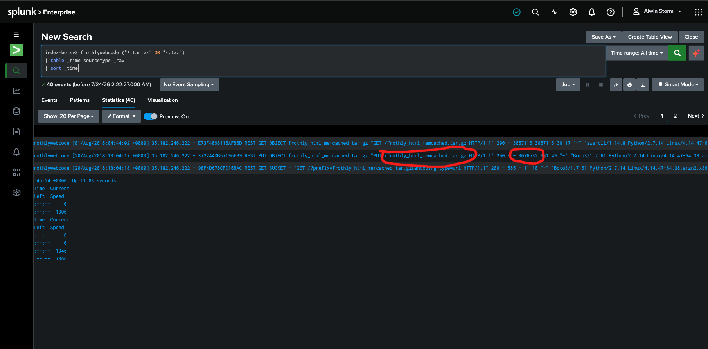

# Splunk Threat Hunting Lab : Public S3 Bucket Exposure
**Author:** Alvin Espinoza  
**Date:** 7/24/2026  
**Focus Area:** SOC Detection & Cloud Security

---

## 1. Objective

I wanted to practice the real workflow a SOC analyst uses when an alert comes in: start with a question, hunt through the logs, adjust when the first searches fail, dig into the details, and write everything up clearly.

The main focus of this lab was a realistic cloud misconfiguration. Someone made an S3 bucket public by accident. I needed to find:

- The exact API call that opened it up
- Which files got uploaded while it was public
- How big the biggest file was
- And document the full path I took, including the dead ends

I also used this lab to get more comfortable with Splunk SPL, reading nested CloudTrail JSON, and pivoting between different log sources.

---

## 2. Environment & Tools

| Component  | Detail                               |
| ---------- | ------------------------------------ |
| SIEM       | Splunk Enterprise 10.4.1 (macOS)     |
| License    | Splunk Developer License - Alwin Storm (10 GB)     |
| Dataset    | Official BOTS v3 pre-indexed dataset |
| Time range | All Time (August 2018 data only)     |

**The data sources I used:** `aws:cloudtrail`, `aws:s3:accesslogs`, `WinHostMon`, `osquery:results`

I took screenshots at every important step so I could document the process properly.

---

## 3. Execution Log

### Phase 1 – Getting Oriented

1. Confirmed the data was loaded and searchable:
   ```
   index=botsv3 earliest=0
   ```
   Over 1.6 million events came back. Both `earliest=0` and the All Time picker matter here — the data is from 2018, so Splunk’s default 24-hour window returns nothing.
   
   

2. Listed the IAM users that showed up in CloudTrail:
   ```
   index=botsv3 sourcetype=aws:cloudtrail
   | stats count by userIdentity.userName
   | sort userIdentity.userName
   ```
   Four accounts appeared: `bstoll`, `btun`, `splunk_access`, and `web_admin`.



3. Found the field that shows whether an API call was made with MFA:
   ```
   index=botsv3 sourcetype=aws:cloudtrail
   | search userIdentity.sessionContext.attributes.mfaAuthenticated=*
   | table userIdentity.userName userIdentity.sessionContext.attributes.mfaAuthenticated
   | dedup userIdentity.userName
   ```
   The field is `userIdentity.sessionContext.attributes.mfaAuthenticated`. Every account came back `false` — nobody in this environment was using multi-factor authentication, including the account that later made the bucket public.
   
4. Looked for hardware details on the servers. My first attempt with `osquery:results` only returned process-monitoring events, not inventory. I pivoted to `WinHostMon` and found the processor on host `FYODOR-L`: **Intel Core i7-4980HQ**.
    

### Phase 2 – Finding the Public Bucket

5. My first searches for the word “public” returned nothing useful. AWS doesn’t write the word “public” in the logs. It records the technical API call (`PutBucketAcl`) and buries the actual permission in nested fields. “Public” is a conclusion a human draws, not a value the system stores.

6. Switched to the specific API calls that change bucket permissions:
   ```
   index=botsv3 sourcetype=aws:cloudtrail
   | search eventName=PutBucketAcl OR eventName=PutBucketPolicy OR eventName=PutBucketPublicAccessBlock
   | table _time userIdentity.userName eventName eventID requestParameters.bucketName
   | sort _time
   ```
   
	Two `PutBucketAcl` events came back, both by `bstoll`, both against the bucket `frothlywebcode`.
   

7. Expanded the nested fields (`requestParameters`, `AccessControlPolicy`, `Grant`) until the smoking gun appeared. Among the normal grants sat two entries for the AWS “everyone on the internet” group:

   - URI: `http://acs.amazonaws.com/groups/global/AllUsers` — Permission: **READ**
   - URI: `http://acs.amazonaws.com/groups/global/AllUsers` — Permission: **WRITE**
   

8. Isolated the specific event that granted the access.  
   **Event ID:** `ab45689d-69cd-41e7-8705-5350402cf7ac`  
   **Bucket name:** `frothlywebcode`
   

### Phase 3  What Was Uploaded While It Was Open

9. I looked for the file uploads in CloudTrail. They weren’t there.

10. This was the key pivot. CloudTrail management events record changes to the bucket’s *configuration*. They told me who changed the settings. Object level activity lives somewhere else. For that I needed the S3 access logs (the “door camera” footage showing who actually went through the open door and what they carried).

    ```
    index=botsv3 frothlywebcode "*.txt"
    | table _time sourcetype source _raw
    | sort _time
    ```

    
    Found `OPEN_BUCKET_PLEASE_FIX.txt`, uploaded with `REST.PUT.OBJECT`.

11. Then looked for larger files:
    ```
    index=botsv3 frothlywebcode ("*.tar.gz" OR "*.tgz")
    | table _time sourcetype _raw
    | sort _time
    ```
    
	Found `frothly_html_memcached.tar.gz`. There was no clean extracted size field, so the byte count had to be read straight from the raw log line: **3,076,532 bytes = 2.93 MB**.
	


---

## 4. Results & Analyst Debrief

### Main Findings

- **Public bucket identified:** `frothlywebcode`
- **API call that made it public:** `PutBucketAcl` (Event ID `ab45689d-69cd-41e7-8705-5350402cf7ac`)
- **Who did it:** IAM user `bstoll`
- **Permission granted:** `AllUsers` received READ and WRITE
- **Text file uploaded while public:** `OPEN_BUCKET_PLEASE_FIX.txt`
- **Archive uploaded while public:** `frothly_html_memcached.tar.gz` (2.93 MB)
- **Contributing control gap:** None of the four IAM accounts were using MFA

### What Worked and What Didn’t

**What worked:**
- Narrowing from broad keyword searches to specific event names.
- Expanding nested JSON until the real permission appeared.
- Pivoting to a different sourcetype whenever the first one came up empty.

**What didn’t work at first:**
- Searching for the word “public” (AWS doesn’t write it that way)
- Querying `osquery:results` for hardware info  it returned process events and not inventory.
- Expecting file uploads to show up in CloudTrail management events.
- Looking for a clean “size” field.  I had to read it from the raw log line. Trench mode activated.

### Key Lessons

The biggest lesson was the difference between the two log sources:

-  **CloudTrail management events** act like the building’s maintenance log. They tell you someone changed the lock and propped the front door open.
- **S3 access logs** acts the door camera. It shows who walked through the open door and what they carried.

I needed both to tell the full story. That pivot is the part I’m most proud of in this lab.

The second lesson goes beyond AWS **search for what the system writes, not what people call it.** “Public” got me nothing because it’s a human word. The system wrote `PutBucketAcl` and `AllUsers`. It’s the same reason you don’t search Windows logs for “hacked”,  you search for the event ID. I ran into the same idea in my Wazuh lab with Rule 5763.

Also real investigations are messy. Several of my searches went nowhere before the right one landed. Documenting the failures made the write up more useful in my opinion instead of only showing the query that worked. 

### Real-World Application

This is a classic cloud misconfiguration that still happens all the time.

**Detection ideas:**
- Alert on `PutBucketAcl` or `PutBucketPolicy` events that grant `AllUsers` or `AuthenticatedUsers`
- Alert on privileged API calls made without MFA (`mfaAuthenticated=false`)

**Prevention:**
- Turn on S3 Block Public Access at the account level.
- Prefer bucket policies over ACLs.
- Use “Bucket owner enforced” so ACLs are disabled.
- Require MFA for accounts that can change bucket permissions.

**Response:**
- Remove the public grant immediately.
- Review everything uploaded during the exposure window.
- Check access logs for unexpected downloads.
- Rotate any secrets that might have been exposed.

**Frameworks:** CIS AWS Foundations, NIST SP 800-53 (AC-3, AU-2, AU-6), MITRE ATT&CK T1530 (Data from Cloud Storage Object)

### Skills This Demonstrates

- Using Splunk for real investigation work.
- Reading CloudTrail and S3 access logs.
- Spotting cloud misconfigurations and measuring impact.
- Knowing when to pivot to a different log source.
- Writing clear documentation that includes both successes and roadblocks.

---

## Scope Note

This investigation was run against the public BOTS v3 training dataset in my own lab. It shows method and tooling, not production or employer data.

---

*End of Report*
